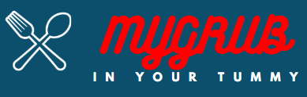

# MyGrub

A grubhub clone, built with vanilla Javascript and a Rails backend, which allows users to choose a restaurant, select items to order, and add items to their cart.

_Made by [Jessica Kim](https://github.com/dbsk11) and [Don Namgyal](https://github.com/dnamgyal) for their Flatiron School Mod 3 project._

## How It Works

A user is able to browse available restaurants by cuisine, browse through the menu by category, and add desired food items to their cart.

## Built Using?

MyGrub was built with a Rails backend which handles user authentication as well as collection/provision of movie data and trailers. The frontend is built with vanilla Javascript which neatly displays the restaurants by cuisine, menu items by category, and the users cart.

## Software Requirements

- Ruby on Rails

## How to Run (frontend)

- Clone this repo as well as the [backend repo](https://github.com/dbsk11/MyGrubBackEnd), navigate to the project root in your terminal.
- Open `index.html`
